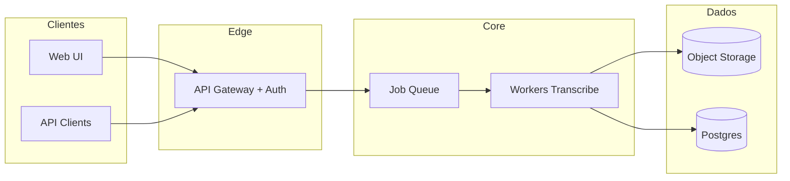

# Arquitetura — plx-transcribe-stack

**PlayLoadX** — © 2024-2026

## Visão

## Camadas

1. **Ingestão** — upload multipart ou URL assinada; vírus scan opcional; limite de tamanho por plano.
2. **Orquestração** — estado da job: `queued` → `preprocessing` → `transcribing` → `postprocess` → `done` / `failed`.
3. **Motor** — Whisper local (CUDA/CPU), ou provedor; modo mapeado para modelo/custo.
4. **Pós-processo** — diarização, tradução, SRT, resegmentação.
5. **Entrega** — download, webhook `job.completed`, export ZIP.

## Segurança

- JWT ou sessão; quotas por `tenant_id`.
- Segredos só em env / vault; nunca em repo.
- Logs sem conteúdo de transcript.
